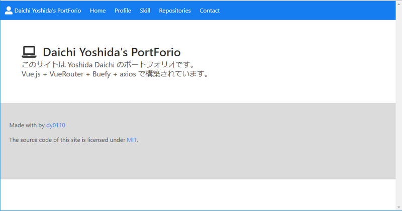

# my-portfolio
自分用のポートフォリオを作成しました。

## 目次

- [説明](#説明)
- [依存関係](#依存関係)
- [インストール](#インストール)
- [ライセンス](#ライセンス)

## 説明

Vue.jsを使ってWebサイトを構築する経験を積みたかったので自分のポートフォリオを作成しました。以下のようなイメージです。  

Vue-Routerを使ったルーティングも実装しています。  
また、axiosを使って自分のリポジトリ一覧を取得して表示するページも作成しました。  
Netlify上でホスティングする予定です。

## 依存関係

* Node.js 8.11.1+
* yarn 1.13.0
* VueCli 3.5.0
* buefy 0.7.3
* axios 0.18.0
* vue-fontawesome 0.1.5
* vue-rate 2.2.0

## インストール

### クローン

```
$ git clone https://github.com/dy0110/my-portfolio.git
$ cd my-portfolio
```

### 依存関係の取り込み

```
$ yarn install
```

### 開発サーバー立ち上げ

```
$ yarn serve
```
## ライセンス

MIT

英語版は[こちら](README.md)